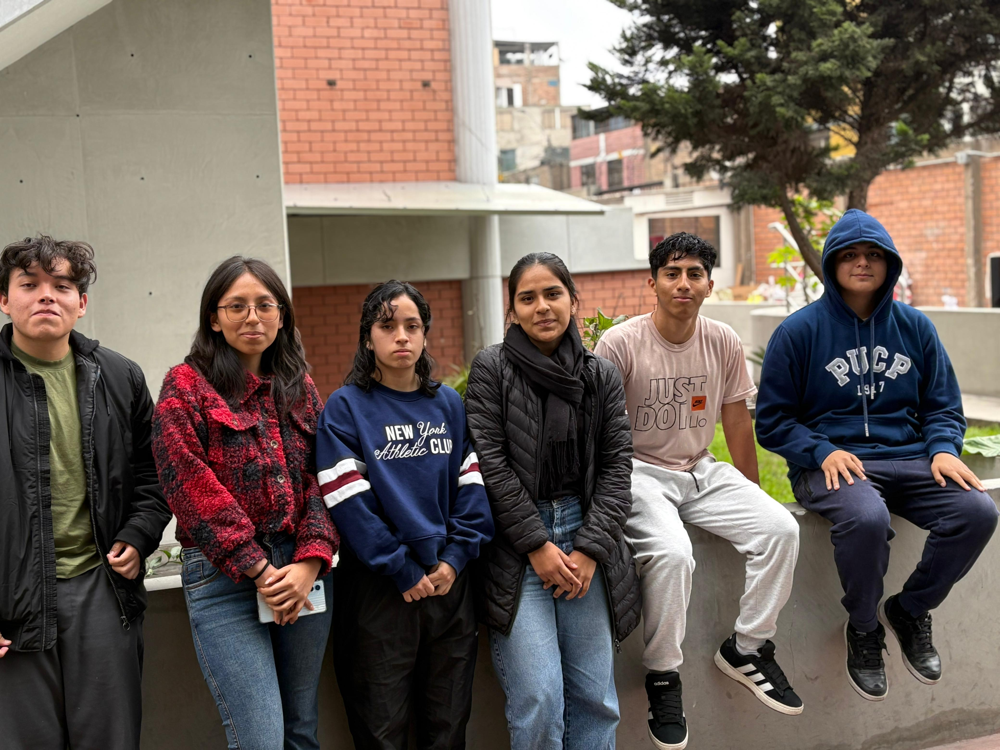
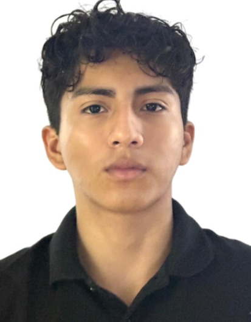
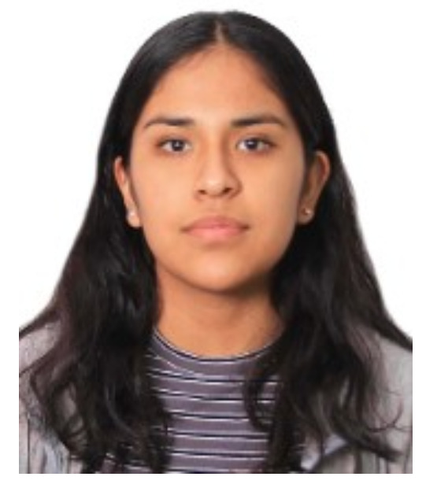
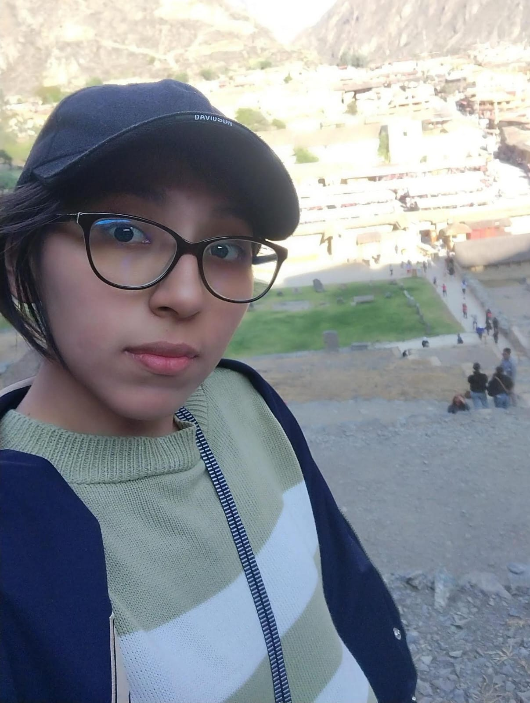
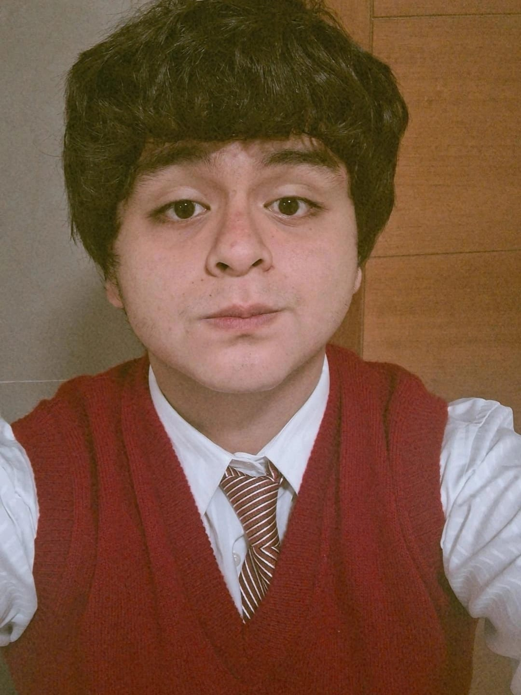
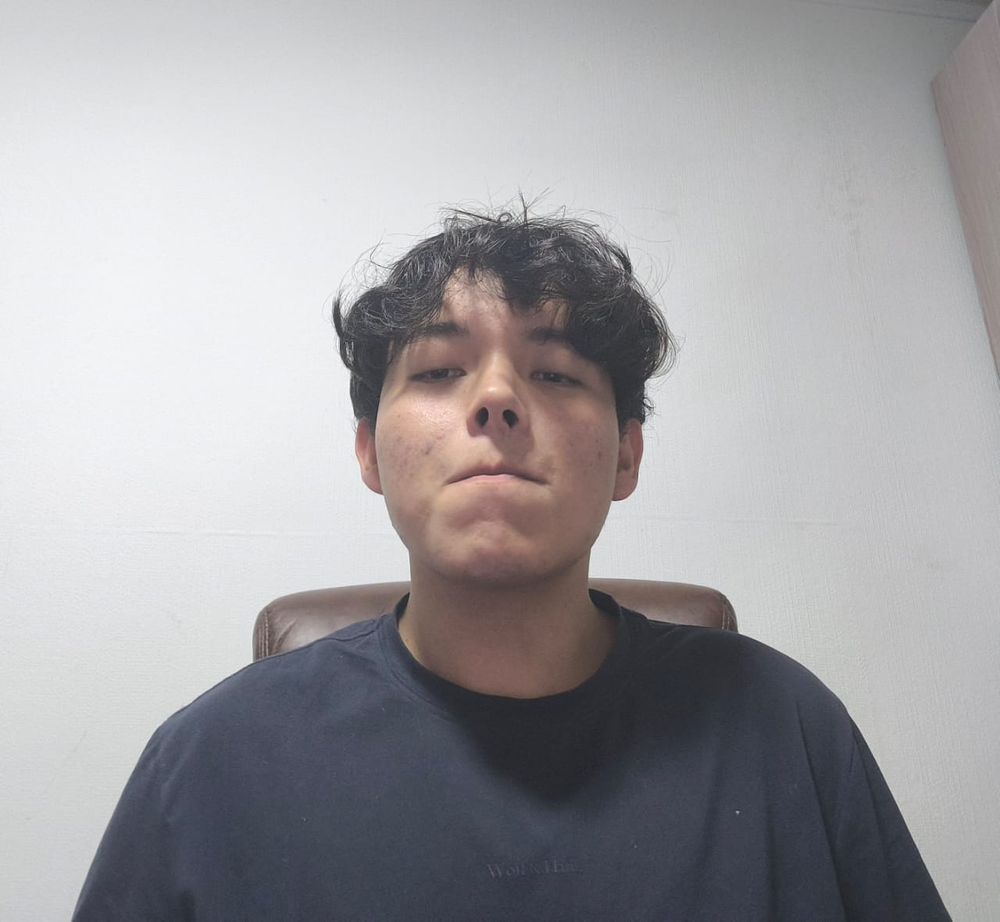
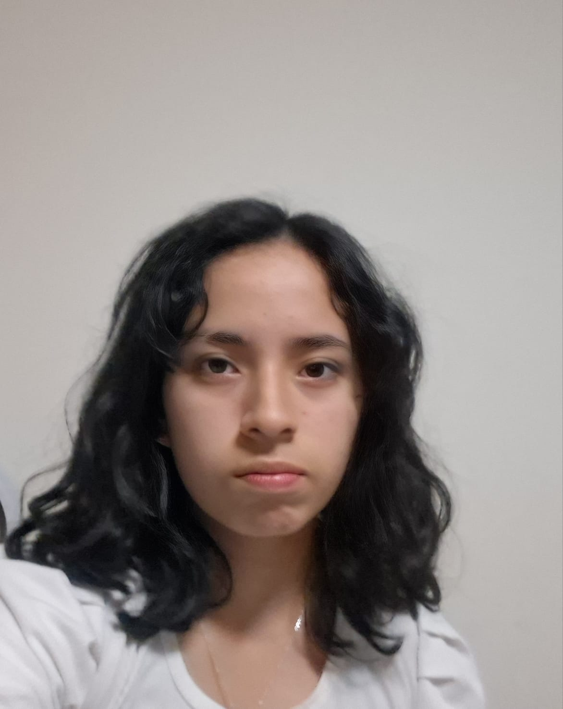

# BIOHACKERS

# ⚙DESCRIPCIÓN DEL GRUPO
Somos estudiantes de ingeniería biomédica y los integrantes del GRUPO 4, el cual lleva por nombre "BIOHACKERS". Este es nuestro repositorio para el curso de Procesos de innovación en bioingeniería en el cual compartiremos nuestros avances a lo largo del curso.
# 🎇INTEGRANTES DEL GRUPO

# 📑DESCRIPCIÓN DE MIEMBROS DEL GRUPO
1) Carlos Felipe Livia Alvarez

EDAD: 17 años

PASATIEMPO: Calistenia, fútbol y piano

Mi área de interés en la carrera de ingenería biomédica es ingeniería clínica

2) Cinthia Jimena Lázaro Tarazona

EDAD: 19 años

PASATIEMPO: Toca piano, montar bicicleta los domingos cerca a la playa y jugar con mis perritos

Mi área de interés en la carrera de ingeniería biomédica es biomecanica y rehabilitación

3) Anna Marypaz Ruiz Castillo

EDAD: 17 años 

PASATIEMPO: ver series y películas de terror, escuchar música, leer, pasar tiempo con mi familia. 

Mi área de interés en ingeniería biomédica es tejidos y biomateriales

4) Eddy Moises Retuerto Rojas

EDAD: 19 años 

PASATIEMPO: esuchar musica, hacer deportes y jugar videojuegos

Mi área de interés en ingeniería es Bioinstrumentación com Inteligencia artificial y tejidos

5) Fernando Tito Arrunategui Cajahuaringa

EDAD: 18 años

PASATIEMPO: Leer, Jugar videojuegos, escuchar música, ver fútbol e investigar sobre la Ingeniería Biomedica

Mi área de interés en ingeniería biomédica es tejidos y biomateriales

6) Rihanna Mia Valverde Barrenechea 

EDAD: 17 años

PASATIEMPO: escuchar música, salir a correr, ver series

Mi área de interés en la carrera de Ing. Biomedica es señales e  imágenes médicas
